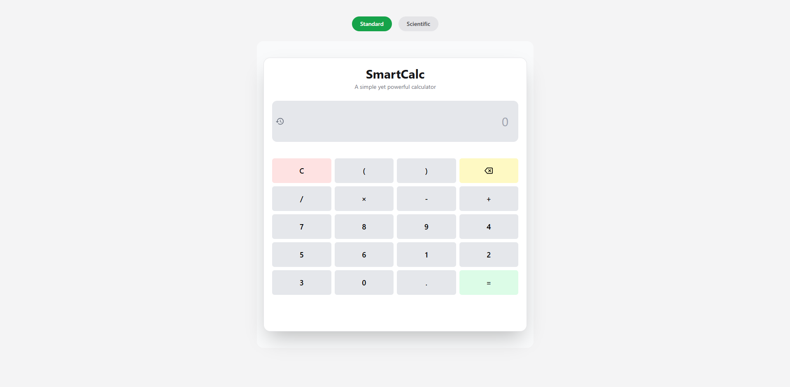
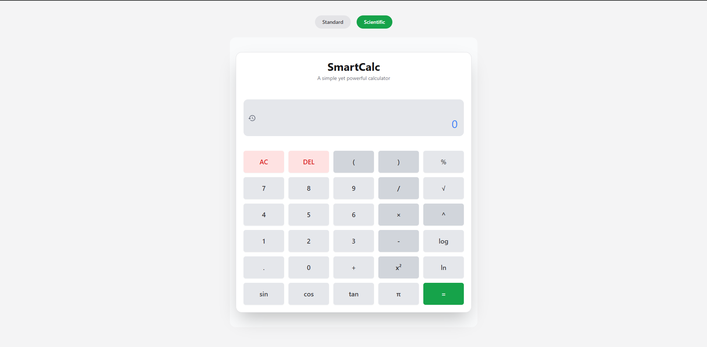

# 🧠 SmartCalc – Scientific & Standard Calculator App

**SmartCalc** is a sleek and intuitive scientific calculator built with **React**, **Vite** and **Tailwind CSS**, featuring real-time expression evaluation, syntax highlighting, auto-closing parentheses, and a dynamic history log. Designed for ease of use and power, it supports both basic and advanced scientific functions with an interactive UI.

---

## 🚀 Features

* ✅ **Basic Operations** — `+`, `-`, `×`, `÷`, `%`, `()`
* ✅ **Standard Functions** — `(`, `)`, `x`, `+`, `-`
* ✅ **Scientific Functions** — `sin`, `cos`, `tan`, `log`, `ln`, `√`, `x²`, `π`
* ✅ **Auto-Closing Parentheses** — Smart insertion of numbers into functions like `sin(45)`
* ✅ **Syntax Highlighting** — Clear display of numbers, operators, and functions
* ✅ **Keyboard & Click Input** — Use keyboard or buttons to enter expressions
* ✅ **Persistent History** — View a modal with previously evaluated expressions
* ✅ **Responsive Design** — Mobile-friendly.

---

## 🛠️ Built With

* ⚛️ **React + Vite** — Component-based UI
* 🎨 **Tailwind CSS** — Utility-first styling
* 🧮 **math.js** — Robust math evaluation engine
* 🗃️ **React Context** — Shared state for history

---

## 📦 Installation

```bash
# 1. Clone the repo
git clone https://github.com/Dev-Rodiyat/SmartCalc.git
cd SmartCalc

# 2. Install dependencies
npm install

# 3. Start the development server
npm run dev
```

The app will be available at `http://localhost:5173`.

---

## 📁 Folder Structure

```
src/
│
├── components/
│   ├── ScientificCalculator.jsx
│   ├── StandardCalculator.jsx
│   ├── CalculatorTabs.jsx
│   ├── CalculatorLayout.jsx
│   └── HistoryModal.jsx
│
├── context/
│   └── HistoryContext.jsx
│
├── tailwind.config.js
└── main.jsx
```

---

## 🧠 Expression Handling

* Internally parses user-friendly expressions (like `×`, `π`, `√`) into valid `math.js` syntax.
* Example conversion before evaluation:

  ```
  sin(30) × √(4) → sin(30 * π / 180) * sqrt(4)
  ```

---

## 📸 Screenshots

>  

---

## ✨ Possible Enhancements

* ✅ Keyboard navigation and shortcuts
* 🔜 Theme customization
* 🔜 Support for parentheses nesting and error hints

---

## 🤝 Contributing

Contributions are welcome! Feel free to fork this repo and submit a pull request.

---

## 🙌 Acknowledgments

* [Math.js](https://mathjs.org/) for expression evaluation
* [Tailwind CSS](https://tailwindcss.com/) for clean, responsive design
* [React Icons](https://react-icons.github.io/react-icons/) for icons

---

Let me know if you'd like a version tailored for deployment on Vercel or Netlify, or want a dark mode preview added!
